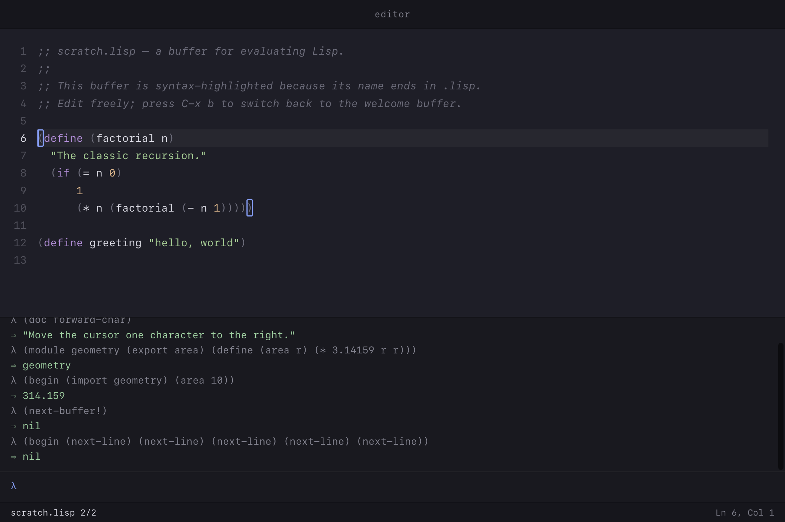

# jmacs

**A Lisp-extensible text editor — a successor in spirit to Emacs, on a clean foundation.**

jmacs is an editor whose behaviour *is* code you can read, redefine, and
reload while it runs. Its keymap, its commands, and its standard library
are written in a custom Lisp dialect that ships with the editor; an
embedded REPL shares the editor's live state. It runs as an Electron
application, is highlighted by tree-sitter, and is built on a small,
legible five-layer architecture.

It is not an Emacs clone and runs no Emacs code. It takes Emacs's
deepest idea — *the editor as a living environment, every behaviour
modifiable from inside* — and rebuilds it without forty years of
incidental complexity.



---

## Contents

- [What it is](#what-it-is)
- [Highlights](#highlights)
- [Quick start](#quick-start)
- [Keybindings](#keybindings)
- [The Lisp](#the-lisp)
- [Architecture](#architecture)
- [Project layout](#project-layout)
- [Development](#development)
- [Status and roadmap](#status-and-roadmap)
- [Design principles](#design-principles)
- [How it was built](#how-it-was-built)
- [License](#license)

---

## What it is

jmacs is a working, self-hosting, extensible editor. "Self-hosting"
here means something specific: the editor's commands and key bindings
are not hardcoded in JavaScript — they are Lisp procedures in
`packages/stdlib/lisp/`, loaded at startup and dispatched on every
keystroke. Press `C-x C-r` and the editor re-evaluates its own standard
library without restarting. Type `(define (forward-word) …)` into the
REPL and the editor's behaviour changes under you.

The editor is built for the person who finds the boundary between
"user" and "developer" of their tools artificial — who wants to write a
small function to fix a small annoyance, and have it take effect
immediately. It is deliberately not aimed at a mass audience.

Two extension languages are first-class: the custom **Lisp** (the
primary idiom, what gives the editor its character) and **JavaScript**
(because the runtime is already JavaScript, and the npm ecosystem is
worth reaching). Both bind to the same buffer API.

## Highlights

- **Editing** — insert/delete, undo/redo, character/word/line motion,
  selection, a kill ring (cut/copy/paste), transpose, comment toggling,
  auto-indent.
- **Search & replace** — incremental search forward (`C-s`) and
  backward (`C-r`) with live match highlighting; `goto-line`;
  whole-buffer replace.
- **Multiple buffers** — a buffer list, a fuzzy-completing switcher,
  file open/save through native dialogs, an unsaved-changes indicator.
- **A custom Lisp runtime** — a reader, a tree-walking evaluator,
  lexical scope, closures, macros, first-class modules with hot reload,
  `try`/`catch`, ~90 primitives, and self-documentation.
- **An embedded REPL** — evaluate Lisp against the editor's live
  buffers; `(insert! "x")` edits the visible document.
- **Syntax highlighting** — tree-sitter for JavaScript, a tokenizer for
  the Lisp dialect; run-based rendering.
- **A real editor surface** — a line-number gutter, current-line
  highlight, matching-bracket outline, a blinking cursor, a modeline.
- **Discoverability** — an `M-x` command palette with fuzzy matching;
  `C-h k` / `C-h f` ask the editor what a key or command does.
- **Hot reload** — change the editor's own Lisp and reload it live.

Around 259 tests across the five packages, plus an Electron smoke test
that drives the whole stack in a real window.

## Quick start

Requirements: **Node 20+** and **pnpm** (via Corepack — `corepack enable pnpm`).

```bash
git clone <repository-url> jmacs
cd jmacs
pnpm install
pnpm dev          # opens the editor in an Electron window
pnpm test         # runs every package's test suite
```

On first launch the editor opens to a welcome buffer and a `scratch.lisp`
buffer. The REPL panel is at the bottom — click into it and evaluate
`(+ 1 2 3)`, or `(doc forward-char)`, or `(insert! "hello")` and watch
the buffer above change.

## Keybindings

Bindings are defined in Lisp (`packages/stdlib/lisp/keymap.lisp`) and
can be changed there or from the REPL. `C-` is Ctrl **or** Cmd; `M-` is
Alt/Option; `S-` is Shift.

### Movement

| Key | Command |
|-----|---------|
| arrows, `C-f` `C-b` `C-n` `C-p` | by character / line |
| `M-f` `M-b` | by word |
| `C-a` `C-e` / `Home` `End` | line start / end |
| `C-←` `C-→` | line start / end |
| `C-↑` `C-↓` | buffer start / end |
| `M-g` | go to line |
| `C-l` | recentre the viewport on the cursor |
| `S-` + any motion | extend the selection |

### Editing

| Key | Command |
|-----|---------|
| `Backspace` / `Delete`, `C-d` | delete around the cursor |
| `M-d` / `M-Backspace` | kill word forward / backward |
| `C-w` / `M-w` | kill / copy the region |
| `C-k` / `C-y` | kill to end of line / yank |
| `C-t` | transpose characters |
| `C-x ;` | comment / uncomment the line |
| `M-r` | replace every occurrence of a string |
| `Enter` | newline, keeping indentation |
| `C-z` / `C-S-z` | undo / redo |
| `C-x h` | select the whole buffer |
| `C-g` | cancel a key sequence / clear the selection |

### Search, files, buffers, help

| Key | Command |
|-----|---------|
| `C-s` / `C-r` | incremental search forward / backward |
| `C-x C-f` / `C-x C-s` | open file / save buffer |
| `C-x b` | switch buffer (fuzzy completion) |
| `C-x ←` / `C-x →` / `C-x n` | previous / next / new buffer |
| `M-x` | command palette |
| `C-h k` / `C-h f` | describe a key / a command |
| `C-x C-r` | reload the standard library (hot reload) |

## The Lisp

The editor embeds a custom Lisp dialect: Scheme-dominant in semantics
(lexical scope, applicative order), Clojure-influenced in its data
literals (`[vectors]`, `{:maps 1}`, `:keywords`), with a procedural
macro system. It is a tree-walking interpreter written in vanilla
JavaScript. The full specification is in
[`docs/spec/lisp.md`](docs/spec/lisp.md).

```lisp
;; A module with a private helper and an exported command.
(module greetings
  (export greet)
  (define (-prefix) "hello, ")          ; private
  (define (greet name)                  ; exported
    (str (-prefix) name)))

(import greetings)
(greet "world")                          ; => "hello, world"

;; Redefine a command; the editor changes immediately.
(define (forward-word) (goto! (word-forward-offset)))
```

The language has special forms (`define`, `lambda`, `if`, `let`,
`cond`, `quasiquote`, `defmacro`, `module`, `import`, `try`, …) and
roughly 90 primitives — arithmetic, lists, higher-order functions,
strings, vectors, maps, and introspection. Every procedure carries its
docstring and source location; `(doc forward-word)` and
`(describe map)` ask the editor about itself.

**The REPL** at the foot of the window shares the editor's interpreter
and buffers. **Hot reload**: re-evaluating a `module` reuses its
environment, and `reload-stdlib` re-evaluates the whole standard
library — the running editor switches to the new definitions at once,
because the keymap binds command *names* and resolves them late.

> The macro system is procedural (non-hygienic) in this version;
> hygienic `syntax-case` macros are the planned target. See the spec
> for the full list of settled and deferred decisions.

## Architecture

The editor is five layers with deliberately narrow interfaces. Dataflow
is one-directional: input becomes commands, commands mutate the buffer,
buffer changes propagate to the renderer. Full detail is in
[`docs/ARCHITECTURE.md`](docs/ARCHITECTURE.md) and the L2 API in
[`docs/api/layer2.md`](docs/api/layer2.md).

| Layer | Package | Responsibility |
|-------|---------|----------------|
| **L0** Host | `apps/desktop` | Electron — window, filesystem, IPC |
| **L1** Storage | `packages/storage` | the text data structure, edit events |
| **L2** Buffer | `packages/buffer` | cursor, selection, editing, change events |
| **L3** Lisp | `packages/lisp` | the Lisp runtime |
| **L4** Renderer | `packages/renderer` | DOM projection and input |
| — | `packages/stdlib` | the editor's commands and keymap, in Lisp |

The three layers L1 → L2 → L4 are the dataflow *spine*; L0 is the
platform beneath, and L3 is the extension runtime that hangs off the L2
API. The renderer never mutates the buffer — input is dispatched as
commands, the buffer emits events, and those events drive rendering.

## Project layout

```
jmacs/
  apps/
    desktop/            L0 — the Electron application
  packages/
    storage/            L1 — text storage
    buffer/             L2 — the buffer / semantic model
    lisp/               L3 — the Lisp runtime
    renderer/           L4 — the DOM editor surface
    stdlib/             commands and keymap, written in Lisp
  docs/
    VISION.md           why the editor exists
    ARCHITECTURE.md     how it is built
    spec/lisp.md        the Lisp specification
    api/layer2.md       the L2 buffer API and event protocol
  plans/                the original planning documents
  architect-notes.md    the build log
```

It is a pnpm workspace. There is **no bundler**: the renderer loads the
workspace packages as native ES modules through an import map.

## Development

```bash
pnpm test                                 # all package test suites
pnpm --filter @editor/lisp test            # one package
pnpm --filter @editor/desktop smoke        # the Electron smoke test
pnpm --filter @editor/desktop screenshot   # capture a PNG of the editor
```

Tests use the Node built-in test runner (`node --test`) — no test
framework dependency. The pure logic (the Lisp runtime, projection,
key normalisation, fuzzy matching, bracket matching) is unit-tested;
the DOM and the wired-together application are covered by the smoke
test, which launches a hidden Electron window and exercises rendering,
the keymap, search, the REPL, file I/O and more.

Conventions: work happens on branches, never directly on `main`; a
pre-commit hook runs the tests and blocks commits to `main`; commit
messages follow Conventional Commits. See
[`CLAUDE.md`](CLAUDE.md) for the full working agreements.

## Status and roadmap

**Working today.** The editor opens, edits, searches, replaces, manages
multiple buffers, opens and saves files, highlights syntax, runs an
embedded Lisp REPL, and hot-reloads its own standard library. It is
usable for editing real text, including its own source.

**Known limitations.**

- No view virtualisation — all lines are in the DOM, so very large
  files would render slowly.
- The Lisp dialect is highlighted by a tokenizer, not a tree-sitter
  grammar (it is a custom, still-evolving dialect).
- Undo is per-keystroke rather than per-command.
- Macros are procedural, not hygienic.
- One window; macOS is the supported platform.
- No LSP integration yet.

**Likely next.** View virtualisation; command-level undo grouping;
text properties, overlays, markers and modes at L2; hygienic macros;
an LSP client; Lisp-to-JavaScript interop. None of these change the
settled core.

## Design principles

Two commitments shape every decision.

**Legibility.** The editor should be comprehensible to the people who
use it — the architecture has a shape you can hold in your head, the
language has rules you can state precisely, the layers have clear
responsibilities, and the system explains itself when asked. When two
designs conflict, the more comprehensible one wins.

**Beautiful by default.** Visual quality is treated as architectural —
present from the first second, owned, not deferred to a theming system.

The fuller statement of intent is in [`docs/VISION.md`](docs/VISION.md).

## How it was built

jmacs was built from an empty repository, collaboratively with Claude
Code, in a small number of intensive sessions. The five layers, the
Lisp runtime, the standard library and the application were written and
tested incrementally; `architect-notes.md` is the running log of that
work, including the decisions and trade-offs made along the way.

## License

This project does not yet carry an open-source license; all rights are
reserved by default. Add a `LICENSE` file before publishing or sharing.
